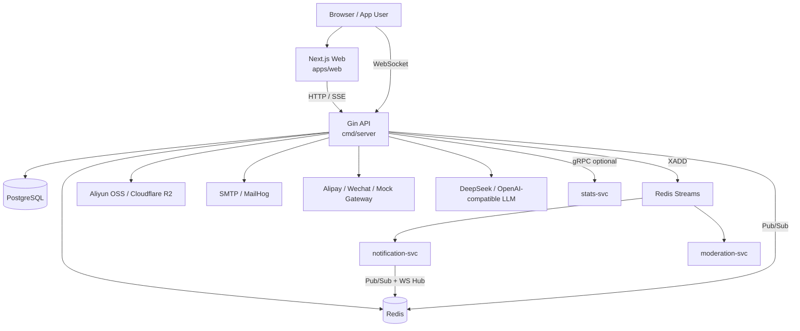
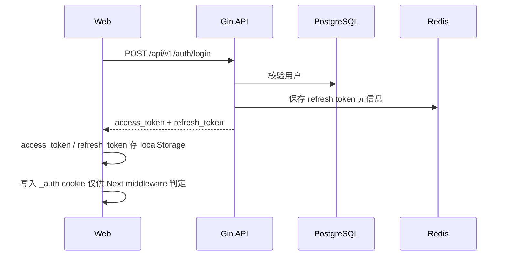
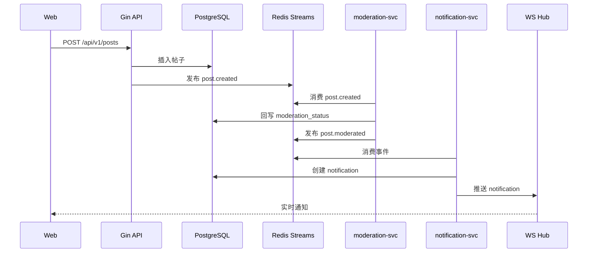
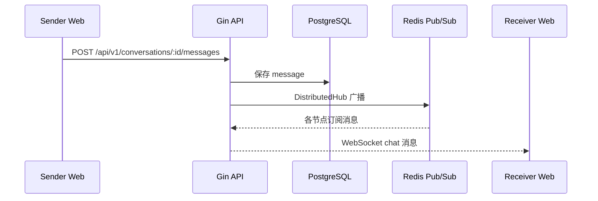

# 项目架构与当前完成度

> 基于仓库代码现状整理，时间点为 2026-03-16。本文描述的是“当前代码已经做到什么”，不是未来规划。

## 1. 项目一句话

这是一个面向 Furry 社区的全栈 monorepo，当前主线已经从传统内容站演进为：

- 一个以社区内容、圈子、活动、私信、通知、创作者打赏为核心的 Go + Next.js 平台
- 一个“单体 API 优先，事件驱动扩展”的后端架构
- 一个已经具备管理后台、AI 助手、可观测性和多种部署清单的工程化项目

## 2. 目前已经做了什么

### 2.1 已落地的业务能力

- 用户系统
  - 注册、登录、刷新 Token、退出登录
  - 忘记密码 / 重置密码
  - 邮箱验证与重发验证
  - 个人资料编辑，包含 `furry_name`、`species`、头像、简介、站点链接、地区等字段
  - JWT + Redis 黑名单 + RBAC 角色体系

- 社区内容
  - 发帖、删帖、改帖、点赞、书签、举报、屏蔽
  - 帖子可见性：`public` / `followers_only` / `private`
  - 评论、回复、评论点赞
  - 关注 / 取关、关注流 `/feed`
  - 发现页 `/explore`、标签页 `/tags/[tag]`
  - 全文搜索 `/search`，覆盖帖子、用户，并保留音乐搜索入口

- 圈子与活动
  - 圈子列表、圈子详情、加入/退出圈子
  - 圈子帖子、圈子标签、精选帖、置顶帖、公告、规则
  - 我的圈子管理面板 `/groups/manage`
  - 活动列表、活动详情、创建活动、参加活动

- 实时能力
  - 私信会话、消息发送、已读
  - WebSocket 单连接推送
  - Redis Pub/Sub 分布式 WS Hub
  - 通知中心页面与未读数查询

- 创作者能力
  - 打赏订单创建
  - 支付宝 / 微信支付接口接线
  - 赞助页 `/sponsor`
  - 创作者统计页 `/creator`

- AI 助手
  - 站内助手浮层 UI
  - SSE 流式回复
  - 助手会话持久化
  - 管理后台可配置人设、系统提示词、可检索内容源

- 管理后台
  - 仪表盘 / analytics
  - 用户管理
  - 评论管理
  - 帖子审核
  - 举报处理
  - AI 助手设置

- 运维与工程化
  - `/health`、`/ready`、`/metrics`、`/debug/pprof/*`
  - `studio-cli` 运维 / smoke / seed / pprof / perf 工具
  - Docker Compose、本地脚本、Kubernetes 清单
  - 数据库迁移、Proto、gRPC、Redis Streams、Prometheus 指标

### 2.2 从代码规模看当前状态

- `cmd/` 下有 6 个可执行入口
- `internal/domain/` 下有 35 个领域文件
- `internal/usecase/` 下有 30 个用例服务文件
- `internal/transport/http/handler/` 下有 26 个 HTTP handler
- `apps/web/src/app/` 下有 45 个页面文件
- `migrations/` 下有 86 个 SQL 文件，对应 43 组迁移

结论：这不是“只有几张静态页面”的 demo，而是一个已经形成完整后端分层和前端页面矩阵的中型工程。

## 3. 总体架构

当前实际运行模式更接近：

- 默认开发模式：`Next.js + 单体 API + PostgreSQL + Redis + MailHog`
- 扩展模式：再额外启动 `notification-svc`、`moderation-svc`、`stats-svc`
- 部署思路：单体 API 可先跑起来，再把统计、通知、审核拆成旁路服务

## 4. 代码分层

### 4.1 后端分层

| 层 | 目录 | 作用 |
|---|---|---|
| 入口层 | `cmd/*` | 启动主 API、stats、notification、moderation、seed、studio-cli |
| 配置层 | `configs/*` | YAML + 环境变量加载，集中定义 server/db/redis/jwt/oss/grpc/assistant 等配置 |
| 领域层 | `internal/domain/*` | 实体、错误、Repository 接口、权限模型 |
| 用例层 | `internal/usecase/*` | 业务编排，承接 domain 和 infra |
| 基础设施层 | `internal/infra/*` | PostgreSQL、Redis、OSS、支付、LLM、审核、Streams、gRPC client |
| 传输层 | `internal/transport/http` | Gin router、handler、中间件 |
| 传输层 | `internal/transport/grpc` | stats / notification / moderation gRPC server |
| 传输层 | `internal/transport/ws` | WebSocket client、hub、distributed hub |
| 通用包 | `internal/pkg/*` | 错误码、响应、加密、缓存、邮件、分页、shutdown |

### 4.2 前端分层

| 层 | 目录 | 作用 |
|---|---|---|
| 页面层 | `apps/web/src/app/*` | App Router 页面，覆盖首页、动态、搜索、帖子、圈子、活动、管理后台等 |
| 组件层 | `apps/web/src/components/*` | layout、post、assistant、creator、admin、ui 组件 |
| 上下文层 | `apps/web/src/contexts/*` | 登录上下文、WebSocket 上下文 |
| 接口层 | `apps/web/src/lib/api-client.ts` | 当前实际使用的前端 API 封装 |
| Hook 层 | `apps/web/src/hooks/*` | 例如 OSS 直传 |
| 状态层 | `apps/web/src/lib/store/*` | 当前有局部 Zustand store，如购物车草稿等 |

### 4.3 目录现状判断

- 主要活跃代码集中在 `社区 + 圈子 + 活动 + 私信 + 通知 + 打赏 + AI 助手`
- `internal/domain/game`、`product`、`coupon` 等目录仍保留历史建模痕迹
- 当前前端主界面已经明显偏向“社区平台”，不是“游戏商城”

## 5. 服务入口说明

| 可执行入口 | 角色 | 现状 |
|---|---|---|
| `cmd/server` | 主 API 服务 | 当前核心入口，承载大部分 HTTP、WS、DB、缓存和业务逻辑 |
| `cmd/stats-svc` | 统计 gRPC 服务 | 可独立运行，但主 API 已支持本地 fallback |
| `cmd/notification-svc` | 通知事件消费与 gRPC 服务 | 消费 Redis Streams，生成通知并经 WS 推送 |
| `cmd/moderation-svc` | 内容审核事件消费与 gRPC 服务 | 消费 `post.created`，调用阿里云审核，回写帖子状态 |
| `cmd/seed-dev` | 本地演示数据播种 | 用于开发环境 |
| `cmd/studio-cli` | 运维 / 诊断工具 | 健康检查、pprof、perf、smoke、seed |

## 6. 当前主链路

### 6.1 认证与会话

说明：

- 真正的鉴权凭证是 JWT
- `_auth` cookie 只是前端路由守卫用的“登录标记”，不是服务端会话
- Token 撤销和 reset / verify token 都落在 Redis

### 6.2 发帖、审核、通知

说明：

- 目标设计是“帖子创建后进入异步审核链路”
- 当前代码里，主服务已经具备事件发布能力，`moderation-svc` 也已实现
- 但默认开发脚本并不会自动启动 `moderation-svc` / `notification-svc`

### 6.3 私信实时消息

说明：

- 聊天写入走 REST
- 实时送达走 WebSocket
- 多节点转发走 Redis Pub/Sub

## 7. 前端架构现状

### 7.1 当前前端特征

- 使用 Next.js 14 App Router
- 页面已经覆盖首页、动态流、帖子详情、发帖、搜索、圈子、活动、私信、通知、创作者、管理后台
- `Providers` 中统一挂载了：
  - TanStack Query
  - AuthProvider
  - WSProvider
  - ThemeProvider

### 7.2 前端登录与路由保护

- `apps/web/src/middleware.ts` 负责保护 `/feed`、`/messages`、`/profile`、`/settings`、`/creator` 等页面
- 路由保护依赖 `_auth` cookie
- 实际 API 鉴权依赖 `Authorization: Bearer <token>`

### 7.3 当前前端接口层状态

- Web 应用实际使用的是 `apps/web/src/lib/api-client.ts`
- 仓库中还有一个 `packages/api-client` 包
- 但当前 `apps/web` 基本没有直接使用这个共享包，说明共享 SDK 还没有完全收口

## 8. 数据与基础设施

### 8.1 PostgreSQL

承担主数据存储：

- 用户、帖子、评论、点赞、关注
- 会话、消息、通知
- 圈子、活动、成员、公告
- 举报、屏蔽、书签
- 订单、支付、创作者打赏
- AI 助手会话和设置

数据库已经通过 43 组迁移管理，说明 schema 演进不是临时 SQL，而是持续迭代。

### 8.2 Redis

当前 Redis 同时承担：

- Refresh token / blacklist / verify / reset token 存储
- API 级限流
- 排行榜
- WebSocket 分布式消息路由
- Redis Streams 事件总线
- 推荐用户兴趣向量缓存

### 8.3 外部依赖

- OSS：阿里云 OSS / Cloudflare R2
- 内容审核：阿里云 Green
- 支付：支付宝 / 微信 / Mock
- LLM：DeepSeek 或任意 OpenAI-compatible 服务
- 邮件：SMTP，开发期可接 MailHog

## 9. 部署形态

### 9.1 本地开发

当前主路径是：

- `./dev.sh`
- 启动 `PostgreSQL + Redis + MailHog + 主 API + Next.js`

这说明本仓库的默认研发体验仍然是“单体优先”。

### 9.2 Docker Compose

当前仓库保留两套实际在用的 Compose 形态：

- `docker-compose.yml`
  - 本地开发基础设施，仅拉起 PostgreSQL、Redis、MailHog
- `docker-compose.prod.yml`
  - 当前实际生产部署编排，供 CI/CD 与服务器部署使用

说明：

- 研发阶段仍然是“本地进程 + Docker 基础设施”优先
- 生产阶段统一收敛到单服务器 `docker-compose.prod.yml`

## 10. 当前架构边界与真实现状

这一节最重要，因为它描述的是“代码现在真实处于什么阶段”。

### 10.1 架构主判断

当前最准确的描述不是“纯微服务”，而是：

**一个主 API 单体 + 若干旁路服务的渐进式拆分架构。**

原因：

- 主 API 仍承载绝大多数核心业务
- `stats-svc` 已有本地 fallback，说明拆分并非强依赖
- `notification-svc` 与 `moderation-svc` 已经成型，但默认开发链路不会自动拉起

### 10.2 通知链路现状

- 主 API 提供通知查询、已读、未读数、WS 推送能力
- 自动生成“关注 / 点赞 / 评论 / 打赏 / 审核结果”通知，依赖 `notification-svc` 消费 Redis Streams
- 如果只启动默认 `dev.sh`，这条异步生成链路并不完整

### 10.3 审核链路现状

- 仓库里已经有完整的 `moderation-svc`
- 主 API 创建帖子时会发布 `post.created` 事件
- 但当前 `PostService` 在启用事件发布后，主进程仍会把帖子状态提前更新为 `approved`，之后再由审核服务异步回写最终状态
- 这意味着“审核组件已具备，但状态闭环仍需进一步收敛”

### 10.4 OSS / R2 现状

- 前端上传走 `/upload/oss-policy`，本质是 OSS Policy 直传模型
- 阿里云 OSS 方向是完整链路
- Cloudflare R2 当前实现提供的是预签名 URL 能力，不是同样的上传 Policy
- 因此“R2 可作为存储后端”与“R2 直传链路已完全打通”还不能画等号

### 10.5 gRPC 配置现状

- `stats_addr` 在主 API 中已实际接入
- `notification_addr` 和 `moderation_addr` 目前更多是配置预留，主 API 本身没有对应的 gRPC client 调用闭环

## 11. 建议的架构表述

如果要对外介绍这个项目，推荐这样描述：

> 这是一个 Go + Next.js 的社区平台项目，后端采用 Clean Architecture，运行上以单体 API 为核心，并通过 Redis Streams、Redis Pub/Sub 和 gRPC 把统计、通知、审核能力逐步拆到旁路服务。前端已经覆盖社区主流程，后端已经具备运营治理、实时通信和 AI 助手能力，当前处于“主流程可用、异步链路继续收口”的阶段。

## 12. 后续演进建议

如果继续往下做，优先级建议如下：

1. 先把通知和审核链路收口为“默认开发脚本即可跑通”
2. 修正帖子审核状态流，避免事件发布后立即自动批准
3. 统一前端 API client，决定保留 `apps/web/src/lib/api-client.ts` 还是迁移到 `packages/api-client`
4. 统一 OSS / R2 上传抽象，补齐 R2 直传策略
5. 清理历史遗留领域目录和未使用配置，降低认知成本
