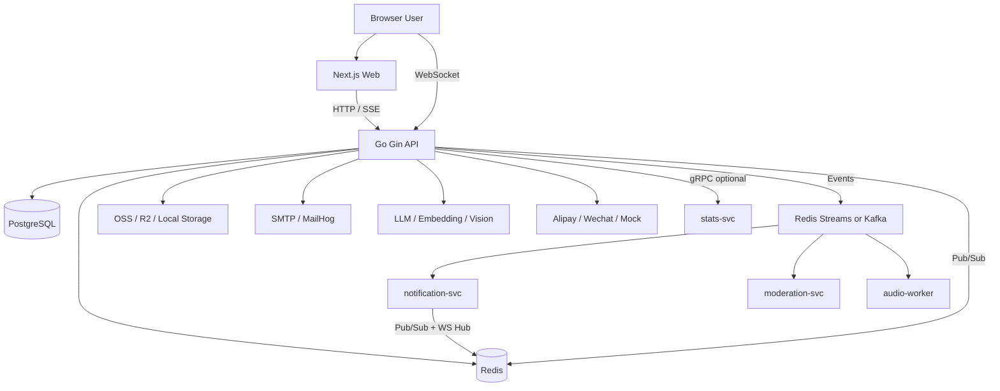
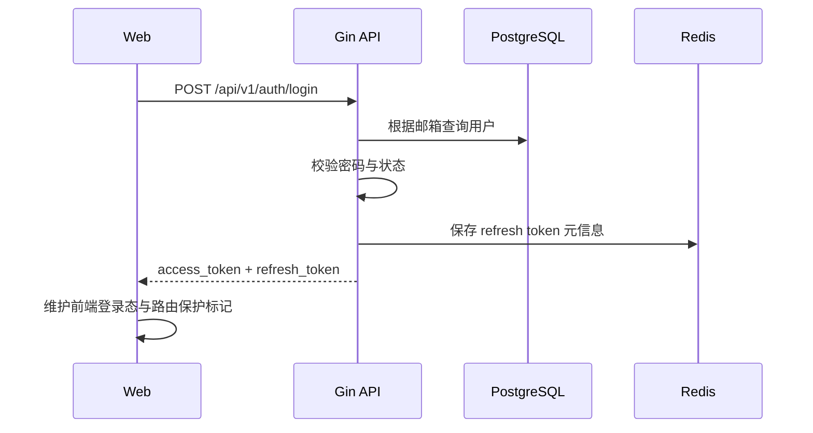
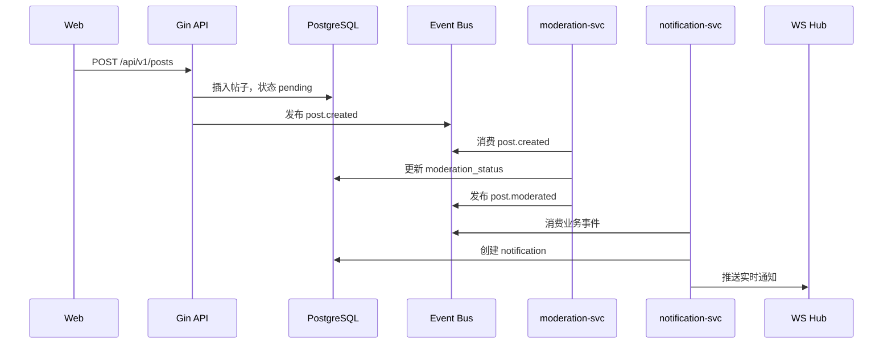
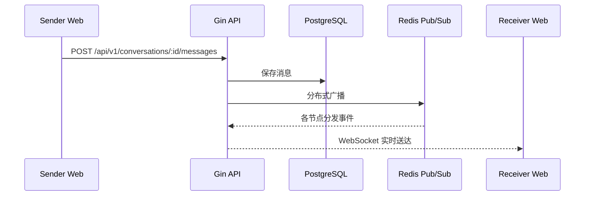
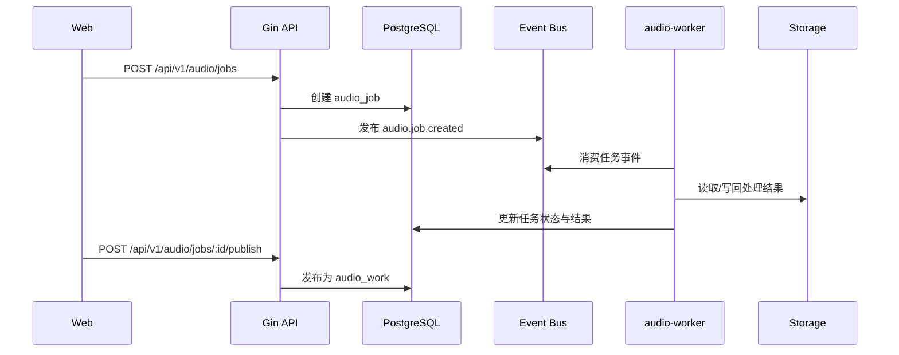
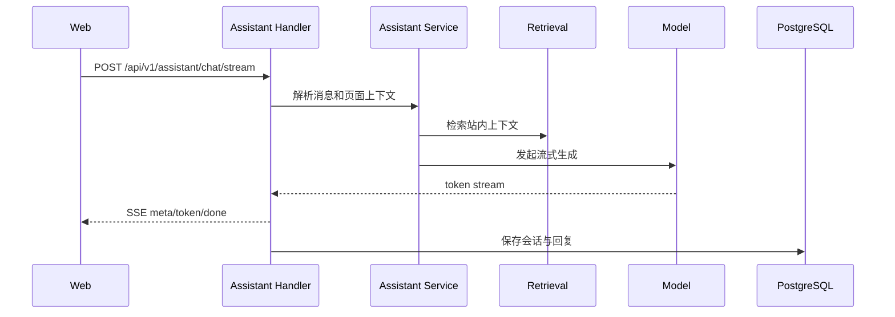
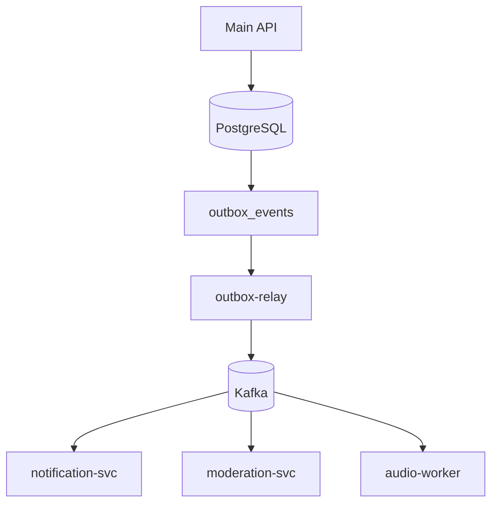

# 平台技术文档

> 文档状态：基于当前仓库代码整理  
> 更新时间：2026-03-31  
> 适用范围：`go-web` 平台仓库整体技术说明  
> 目标读者：研发、面试沟通、接手维护、部署运维

## 1. 文档目标

本文档用于从平台视角说明当前仓库的技术形态，而不是只描述某一个模块。

本文重点回答以下问题：

- 这个平台的业务定位是什么
- 平台当前已经落地了哪些能力
- 前后端与基础设施是如何组织的
- 主服务、异步服务、实时链路和 AI/游戏能力如何接入
- 默认运行模式、扩展运行模式、生产部署模式分别是什么
- 当前代码的优势、边界和后续演进方向是什么

## 2. 平台定位

该项目是一个面向 Furry 社区的全栈平台，当前已经从“社区内容站”扩展为一个具备多业务域能力的平台型应用。

平台主线包括：

- 社区内容：注册登录、资料、帖子、评论、关注、书签、举报、屏蔽、搜索、探索
- 社群协作：圈子、活动、群组管理、私信、通知
- 创作者能力：打赏、赞助页、订单、音频作品、音频处理任务
- AI 能力：站内 AI 助手、知识检索、媒体分析、管理后台 AI 配置
- 平台治理：审核、审计、后台、权限、可观测性
- 游戏实验室：`Hex Blitz` 与 `斗地主`

这个项目不是单页 demo，也不是只做 CRUD 的后台项目，而是一个已经形成多模块协同的中型平台工程。

当前仓库规模概览：

| 指标 | 当前数量 |
| --- | --- |
| 可执行入口 | 8 |
| 前端页面路由 | 62 |
| HTTP Handler | 32 |
| Usecase 文件 | 52 |
| 测试文件 | 17 |
| SQL 迁移文件 | 120 |

## 3. 技术栈总览

### 3.1 后端

| 类别 | 选型 |
| --- | --- |
| 语言 | Go 1.22 |
| Web 框架 | Gin |
| 数据库 | PostgreSQL |
| 缓存 / 状态 | Redis |
| 数据访问 | pgx |
| 实时通信 | WebSocket |
| 异步事件 | Redis Streams，Kafka 可选 |
| RPC | gRPC + Protocol Buffers |
| 认证 | JWT + Redis token store / blacklist |
| 日志 | Zap |
| 指标 | Prometheus |
| 性能分析 | pprof |

### 3.2 前端

| 类别 | 选型 |
| --- | --- |
| 框架 | Next.js 14 App Router |
| 语言 | TypeScript |
| UI | React 18 |
| 样式 | Tailwind CSS |
| 数据请求 | TanStack Query |
| 动画 | Framer Motion |
| 组件基础 | Radix UI |
| 局部状态 | Zustand |
| Monorepo | pnpm workspace + Turborepo |

### 3.3 基础设施与三方能力

| 类别 | 选型 |
| --- | --- |
| 对象存储 | 本地存储 / 阿里云 OSS / Cloudflare R2 |
| 邮件 | SMTP / MailHog |
| 支付 | 支付宝 / 微信 / Mock Gateway |
| 内容审核 | 阿里云 Green |
| 大模型 | DeepSeek / OpenAI-compatible API |
| 向量与视觉 | Embedding / Vision API |

## 4. 平台架构概览

### 4.1 总体架构



### 4.2 当前架构原则

- 主业务优先通过单体 API 承载，减少早期过度拆分
- 实时能力通过 WebSocket Hub 统一抽象
- 可异步解耦的链路通过事件总线下沉为旁路服务
- 统计、通知、审核、音频处理可独立进程运行
- 业务事件默认走 Redis Streams，Kafka 为可选增强模式

### 4.3 运行形态

| 形态 | 组成 | 说明 |
| --- | --- | --- |
| 本地默认开发 | `apps/web` + `cmd/server` + `cmd/audio-worker` + PostgreSQL + Redis + MailHog | 主 API 承载大部分业务，音频链路可直接联调 |
| 本地扩展开发 | 再启动 `notification-svc`、`moderation-svc`、`stats-svc`、`audio-worker` | 验证异步链路和服务拆分 |
| Kafka 模式 | 再启动 `outbox-relay` + Kafka | 业务事件总线切到 Kafka |
| 生产部署 | Docker Compose 为主，保留 K8s 清单 | 单机生产拓扑已落地 |

## 5. 仓库结构与分层设计

### 5.1 顶层目录

| 目录 | 作用 |
| --- | --- |
| `cmd/` | 所有可执行入口 |
| `apps/web` | Next.js 前端 |
| `internal/domain` | 领域实体、错误、仓储接口、权限模型 |
| `internal/usecase` | 业务编排与服务层 |
| `internal/infra` | PostgreSQL、Redis、OSS、支付、LLM、事件总线等实现 |
| `internal/transport` | HTTP、gRPC、WebSocket 入口层 |
| `internal/observability` | 指标、观测 HTTP server、业务 metrics |
| `internal/pkg` | 通用库，如错误、响应、加密、缓存、邮件、关闭管理 |
| `migrations` | 数据库迁移 |
| `configs` | 配置结构与默认 YAML |
| `docs` | 架构、接口、部署、专题设计文档 |
| `scripts` | 备份、恢复、健康检查、性能分析脚本 |

### 5.2 后端分层原则

平台采用较清晰的分层结构：

- `domain`
  - 只关心实体、错误、接口、权限模型
  - 不依赖具体传输层和数据库实现
- `usecase`
  - 编排业务流程
  - 承接权限、校验、状态流转、事件触发
- `infra`
  - 封装 PostgreSQL、Redis、OSS、支付、LLM、Streams、Kafka 等基础设施
- `transport`
  - 负责 Gin handler、gRPC server、WebSocket 连接管理、中间件

推荐理解方式：

- `transport` 负责“怎么进来”
- `usecase` 负责“业务怎么做”
- `infra` 负责“依赖怎么落地”
- `domain` 负责“业务对象和规则边界是什么”

### 5.3 前端组织方式

前端基于 App Router，页面、组件和状态分层较明确：

- `src/app/*`
  - 页面路由层
  - 覆盖首页、帖子、圈子、活动、消息、通知、创作者、音频、游戏、后台等
- `src/components/*`
  - UI、业务组件、后台组件、游戏组件
- `src/contexts/*`
  - `AuthProvider`、`WSProvider`、页面上下文
- `src/lib/*`
  - API client、权限工具、游戏目录、工具函数
- `src/hooks/*`
  - 例如 OSS 上传 hook

## 6. 服务入口说明

当前仓库有 8 个主要可执行入口。

| 入口 | 角色 | 说明 |
| --- | --- | --- |
| `cmd/server` | 主 API 服务 | 平台核心服务，承载 HTTP、WS、SSE、主业务逻辑 |
| `cmd/stats-svc` | 统计 gRPC 服务 | 可独立运行，主 API 也支持本地 fallback |
| `cmd/notification-svc` | 通知服务 | 消费业务事件并生成通知 |
| `cmd/moderation-svc` | 审核服务 | 消费内容事件并回写审核状态 |
| `cmd/audio-worker` | 音频任务 Worker | 处理音频任务、重试、发布链路 |
| `cmd/outbox-relay` | Outbox Relay | Kafka 模式下负责把 outbox 事件投递到 Kafka |
| `cmd/seed-dev` | 数据播种工具 | 用于本地开发和演示数据准备 |
| `cmd/studio-cli` | 平台 CLI | 健康检查、smoke、pprof、perf、管理辅助 |

## 7. 已落地业务能力

### 7.1 用户与账号体系

- 注册、登录、刷新令牌、退出登录
- 忘记密码、重置密码
- 邮箱验证与重发验证
- 用户资料编辑
- 社区字段扩展，如 `furry_name`、`species`、个人简介、头像、站点链接
- 管理员强制密码重置
- JWT + Redis token store + blacklist
- RBAC 权限模型

### 7.2 社区内容

- 发帖、删帖、改帖
- 点赞、书签、举报、屏蔽
- 评论、回复、评论点赞
- 可见性控制：`public`、`followers_only`、`private`
- Feed、探索页、热门标签、搜索
- 举报与内容标签

### 7.3 圈子与活动

- 圈子列表、详情、创建、加入、退出
- 圈子成员管理、公告、置顶、精选帖
- 活动列表、详情、创建、报名、管理

### 7.4 实时消息与通知

- 私信会话与消息
- WebSocket 单连接推送
- Redis Pub/Sub 分布式 WS Hub
- 通知中心与未读数

### 7.5 创作者与音频

- 打赏订单创建
- 支付宝 / 微信 / Mock 支付接线
- 赞助页与创作者页
- 音频任务创建、重试、发布
- 音频作品列表、详情、播放事件、点赞、收藏、评论
- 独立 `audio-worker`

### 7.6 AI 助手与多模态

- SSE 流式回复
- 会话持久化
- 知识检索与站内上下文增强
- 媒体分析与管理后台 AI 工具
- 助手设置、提示词、人设配置

### 7.7 管理后台

- 仪表盘
- 用户管理
- 评论管理
- 审核与举报处理
- 审计日志
- AI 助手管理
- 订单、音频、活动、圈子、游戏等后台页面

### 7.8 游戏实验室

- `Hex Blitz`
  - 房间、排行榜、最近对局、回放、专用 WS
- `斗地主`
  - 房间、人机演示、实时对局、托管、战报、排行榜、专用 WS

## 8. 核心运行链路

### 8.1 认证与会话链路



认证实现要点：

- `access token` 用于接口鉴权
- `refresh token` 持久化到 Redis
- 刷新时会校验 Redis 是否存在对应 token
- 退出登录会把 access token 加入黑名单

### 8.2 发帖、审核、通知链路



实现特点：

- 帖子创建与审核解耦
- 审核失败不会阻塞主请求返回
- 当异步发布不可用时，主服务支持本地 fallback 审核
- 通知服务作为独立消费者，不耦合在主链路请求里

### 8.3 聊天与实时推送链路



平台当前选择：

- 消息持久化通过 REST 写入
- 实时到达通过 WebSocket 推送
- 多节点广播通过 Redis Pub/Sub

### 8.4 音频任务链路



当前实现特点：

- 任务状态流转明确
- 支持重试与 `dead_lettered`
- 主服务不承担音频处理计算
- 产物最终回流到公开音频作品域

### 8.5 AI 助手链路



设计特点：

- 使用 SSE 而不是 WebSocket 进行流式输出
- 支持站内知识检索、页面上下文增强
- 支持 fallback、重试、熔断
- 在模型不可用时仍能回退为站内检索结果

### 8.6 游戏房间链路

`Hex Blitz` 与 `斗地主` 当前都采用服务端管理房间状态的方式。

其中 `斗地主` 更强调服务端权威：

- 发牌由服务端完成
- 叫分、出牌、过牌由客户端发送意图
- 牌型识别、胜负判断、回合推进全部在服务端执行
- 玩家断线与超时托管由服务端状态机处理

## 9. 事件总线设计

### 9.1 默认模式：Redis Streams

默认本地和基础模式下，业务事件通过 Redis Streams 发布与消费。

适用场景：

- 发帖后触发审核
- 点赞、关注、评论触发通知
- 音频任务创建后由 worker 处理

优点：

- 接入简单
- 与当前平台 Redis 依赖一致
- 足够支撑本地开发和轻量部署

### 9.2 可选模式：Kafka + Outbox

平台已经具备 Kafka 改造能力，但它是可选增强模式，不是默认必开模式。

Kafka 模式下的关键变化：

- 主业务事件不再依赖主服务直接投递到 Kafka
- 数据写入后通过数据库 trigger 写入 `outbox_events`
- `outbox-relay` 批量扫描 outbox 并投递到 Kafka
- `notification-svc`、`moderation-svc`、`audio-worker` 改为消费 Kafka

当前已接入 outbox / Kafka 的事件包括：

- `post.created`
- `post.moderated`
- `post.liked`
- `user.followed`
- `comment.created`
- `tip.sent`
- `audio.job.created`

### 9.3 Kafka 模式架构



Kafka 模式的价值：

- 业务事件具备更强的解耦能力
- 更适合扩大消费端规模
- 降低主服务直接发布消息失败时的事务一致性风险

## 10. 数据架构

### 10.1 PostgreSQL

PostgreSQL 是平台的核心持久化存储，承载了绝大多数业务实体。

当前数据库大体覆盖以下域：

- 用户、资料、权限、密码重置、邮箱验证
- 帖子、评论、点赞、举报、书签、屏蔽
- 圈子、成员、公告
- 活动、报名
- 会话、消息、通知
- 订单、支付、退款
- 音频任务、音频作品、播放互动
- AI 助手会话、检索、配置
- 游戏对局与回放
- outbox 事件

迁移策略：

- 所有结构变更通过 `migrations/*.sql` 管理
- 当前已有 120 个迁移 SQL 文件
- 本地开发和生产部署均依赖统一迁移流程

### 10.2 Redis

Redis 在平台中的作用不只是缓存。

当前主要用于：

- refresh token 元信息
- token blacklist
- HTTP 速率限制
- 排行榜
- Redis Streams 事件总线
- Redis Pub/Sub 分布式 WebSocket 广播

### 10.3 对象存储

对象存储通过统一抽象接入：

- 本地存储
- 阿里云 OSS
- Cloudflare R2

使用场景：

- 用户上传媒体
- 帖子媒体资源
- 音频源文件与处理结果
- 前端直传与回源访问

平台同时支持 `allowed_hosts` 白名单，用于校验可接受的媒体 URL 来源。

## 11. 实时与并发模型

### 11.1 HTTP 请求模型

- Gin 每个请求天然由 goroutine 处理
- 请求上下文透传到 usecase / repository
- 统一中间件处理恢复、日志、限流、鉴权、指标、CORS、安全头

### 11.2 WebSocket 模型

平台使用 Hub 模型管理连接。

关键点：

- 每个连接拆分为 `readPump` 与 `writePump`
- Hub 通过 channel 接收注册、注销、广播事件
- 使用 `sync.RWMutex` 保护连接映射
- 单用户有最大连接数限制
- 每连接有消息速率限制
- 通过 ping/pong 保持连接健康

### 11.3 房间状态模型

游戏房间状态当前放在服务内内存结构中。

优点：

- 状态推进快
- 实现简单
- 适合当前阶段的实时房间逻辑

代价：

- 服务重启会丢失运行中房间
- 暂不支持跨进程房间迁移

### 11.4 后台任务模型

平台中存在多类后台 goroutine：

- WebSocket Hub 循环
- AI 知识索引周期同步
- 过期订单取消任务
- 音频任务重试轮询
- 斗地主超时托管循环
- 异步消费者的消费主循环

### 11.5 优雅停机

平台支持 graceful shutdown。

主要表现为：

- 进程接收 `SIGINT` / `SIGTERM`
- 使用 `context.WithTimeout` 控制收尾时间
- HTTP 服务优雅关闭
- 后台 goroutine 感知 context 退出

## 12. AI 助手架构

### 12.1 功能定位

AI 助手不是独立聊天产品，而是站内智能助手。

其目标是：

- 回答站内功能问题
- 推荐内容、圈子、活动、创作方向
- 在后台辅助做内容分析与治理

### 12.2 主要技术点

- SSE 流式输出
- 会话持久化
- 检索增强生成
- 媒体分析
- Embedding 检索
- LLM 熔断与重试
- 模型未配置时的降级回复

### 12.3 运行策略

- 根据页面上下文拼接站内提示
- 先构建检索结果和推荐卡片
- 再调用模型进行流式生成
- 模型失败时退回站内检索结果

## 13. 音频平台架构

### 13.1 核心对象

- `audio_job`
  - 处理任务
- `audio_work`
  - 公开展示的音频作品

### 13.2 任务状态

当前任务状态包括：

- `queued`
- `running`
- `succeeded`
- `failed`
- `dead_lettered`

### 13.3 当前任务类型

- `ai_music`
- `voice_convert`
- `voice_enhance`
- `audio_master`

### 13.4 处理链路特点

- 主 API 只创建任务并记录状态
- Worker 异步处理文件
- 失败任务支持自动重试
- 成功后可发布为公开作品
- 播放、点赞、收藏、评论统一进入社区内容生态

## 14. 游戏平台架构

### 14.1 当前游戏能力

游戏系统不是独立仓库，而是接入现有平台体系。

已接入能力：

- 游戏中心
- 游戏详情页
- 游戏专属可玩页
- 对局结果落库
- 战报查看
- 后台游戏概览

### 14.2 Hex Blitz

特点：

- 节奏短
- 房间与排行榜已可用
- 已有回放能力
- 专用 WS 接口已落地

### 14.3 斗地主

特点：

- 三人牌桌
- 支持人机演示房
- 支持创建房间、加入房间、准备、叫分、出牌、过牌、结算
- 支持断线、超时托管、战报、排行榜
- 前后端和 WS 链路均已接入

## 15. 安全、权限与治理

### 15.1 鉴权与权限

- 接口鉴权基于 `Authorization: Bearer <token>`
- 后台与敏感接口依赖角色和权限校验
- 项目中存在明确的 RBAC 权限模型

### 15.2 限流

平台按匿名用户、登录用户、管理员三档设置限流策略。

### 15.3 平台治理能力

- 内容审核
- 举报处理
- 审计日志
- 用户状态管理
- 强制密码重置

### 15.4 诊断面保护

- `/debug/pprof/*` 在 `release` 模式下需要管理员 JWT
- WebSocket 校验来源域名
- 请求和响应具备结构化审计与追踪字段

## 16. 可观测性与运维能力

### 16.1 通用可观测性

平台暴露以下标准诊断入口：

- `/health`
- `/ready`
- `/metrics`
- `/debug/pprof/*`

### 16.2 日志

HTTP 请求日志采用结构化输出，包含：

- `request_id`
- `method`
- `route`
- `path`
- `status`
- `latency`
- `response_bytes`
- `client_ip`
- `user_agent`
- `user_id`
- `role`

### 16.3 指标体系

通用指标：

- `http_request_duration_seconds`
- `http_requests_total`
- `http_slow_requests_total`
- `http_requests_in_flight`

业务指标模块：

- `assistantmetrics`
- `audiometrics`
- `gamemetrics`
- `eventbusmetrics`

### 16.4 平台辅助工具

`studio-cli` 已承载多种平台工具能力：

- 健康检查
- smoke 测试
- pprof 调用
- 性能诊断
- seed 辅助
- 管理操作辅助

## 17. 配置体系

### 17.1 配置来源

平台采用“默认 YAML + 本地覆盖 + 环境变量覆盖”的组合方式。

配置优先级：

```text
STUDIO_* 环境变量 > config.local.yaml > config.yaml
```

### 17.2 主要配置域

- `server`
- `database`
- `redis`
- `kafka`
- `jwt`
- `oss`
- `ratelimit`
- `observability`
- `email`
- `payment`
- `moderation`
- `sponsor`
- `grpc`
- `audio`
- `assistant`

### 17.3 配置特点

- 基础配置文件不包含环境敏感凭据
- 本地开发使用 `config.local.yaml`
- 生产环境主要依赖环境变量注入

## 18. 部署与运行模式

### 18.1 本地开发模式

默认通过 `./dev.sh` 一键启动：

- PostgreSQL
- Redis
- MailHog
- 主 API
- 前端
- 音频 Worker

常见命令：

```bash
./dev.sh
./dev.sh --backend-only
./dev.sh --frontend-only
./dev.sh --no-docker
./dev.sh --stop
```

### 18.2 生产 Docker Compose 模式

当前生产拓扑已经落地为单机 Compose 方案。

主要服务：

- `frontend`
- `backend`
- `postgres`
- `redis`
- `migrate`
- `seed`
- `notification-svc`
- `moderation-svc`
- `audio-worker`
- `outbox-relay`
- `kafka`（可选 profile）

特征：

- `migrate` 作为一次性任务执行迁移
- `backend` 可关闭启动时自动迁移，避免多实例竞争
- 异步服务通过 `async` profile 启动
- Kafka 通过 `kafka` profile 启动

### 18.3 Kubernetes 形态

仓库中保留了 `k8s/base` 与多套 overlay：

- `dev`
- `staging`
- `production`

说明：

- 当前主要生产路径仍是 Docker Compose
- K8s 清单保留了向容器平台迁移的基础能力

## 19. 测试策略

当前测试主要集中在 Go 后端核心逻辑层。

已覆盖的重点包括：

- Assistant Service
- Audio Job Service
- Audio Work Service
- 多模态服务
- Hex Blitz 房间服务
- 斗地主引擎与房间服务
- 基础服务基线测试
- 加密与密码相关能力

当前测试文件数为 17，重点不是 UI 快照，而是业务规则、状态流转和核心服务行为。

## 20. 当前优势

从平台工程角度看，当前代码具备以下明显优势：

- 业务面完整，已形成社区主站 + 创作者 + AI + 游戏的组合能力
- 后端分层清晰，具备良好的可解释性
- 实时能力和异步能力都已落地，不停留在架构设计阶段
- 具备可观测性、治理能力和部署脚本，不只是功能堆砌
- 已经考虑 Redis Streams、Kafka、outbox 等更稳健的事件模式

## 21. 当前边界与已知限制

平台当前仍存在一些明确边界，这些不应被忽略。

### 21.1 房间运行态仍以内存为主

- 游戏房间主要运行在单进程内存中
- 服务重启时会丢失运行中房间
- 暂未实现真正的跨进程房间迁移

### 21.2 本地默认形态偏主服务优先

- 默认 `./dev.sh` 更偏向主站开发体验
- 通知、审核等异步服务默认不全部拉起
- 因此默认本地体验与“完整生产拓扑”仍有差异

### 21.3 前端 API 收口还未完全统一

- `apps/web/src/lib/api-client.ts` 是当前主用接口层
- `packages/api-client` 已存在，但还未完全成为唯一 SDK

### 21.4 Kafka 模式需要额外运维成本

- Topic 管理、broker 健康、outbox relay、异步 profile 都需要额外维护
- 因此 Kafka 更适合作为增强部署模式，而非所有环境默认开启

## 22. 推荐演进方向

基于当前平台状态，推荐优先级如下：

1. 强化实时房间状态恢复机制，例如 Redis 快照或房间恢复
2. 完善异步链路幂等、告警和死信处理的可视化
3. 继续收口前端 API SDK，减少双轨接口层
4. 对高价值链路补充端到端测试与压测
5. 进一步完善后台游戏和音频观测能力

## 23. 相关文档

如需深入某一子主题，可继续阅读：

- `docs/ARCHITECTURE.md`
- `docs/API_CONTRACT.md`
- `docs/GO_ENGINEERING_NOTES.md`
- `docs/DOCKER_PROD_DEPLOY.md`
- `docs/KAFKA_RUNBOOK.md`
- `docs/AUDIO_PLAYBACK_PAGE_PHASE2_ARCHITECTURE.md`

## 24. 结论

当前平台已经形成一条清晰的技术路线：

- 以 Go 单体 API 为核心承载主要业务
- 以 Redis / PostgreSQL 为基础支撑平台状态与数据
- 以 WebSocket、SSE、异步事件补齐实时与后台处理能力
- 以 Docker Compose 为现实可落地的生产部署方式
- 以 Kafka + outbox、K8s、更多治理能力作为可持续扩展方向

如果只用一句话总结当前仓库：

这是一个已经从“功能集合”演进为“平台工程”的全栈项目，具备继续向更高稳定性和更高复杂度演进的基础。
